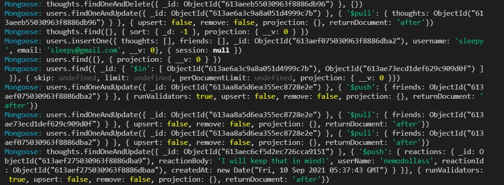

# Social Network API

## Description

---

An API for a social network that uses a NoSQL database, which is able to handle large amounts of unstructured data.

---

## Table of Contents

  - [Installation](#installation)
  - [Usage](#usage)
  - [Walkthrough Video](#walkthrough-video)
  - [Screenshots/GIF](#Screenshots/GIF)
  - [License](#License)
  - [Contributing](#Contributing)
  - [Questions](#Questions)

---

## Installation

1. Clone the repository
   
2. Install mySQL
   
3. npm install

---

## Usage

1. Setup the MongoDB database
2. npm start

---

## Walkthrough Video

Walk through video here - [Youtube Link](https://www.youtube.com/watch?v=DYJ3OeqlAW4)

---

## Screenshots

---

## License

This project is licensed under the [MIT License](https://choosealicense.com/licenses/mit).

---

## Contributing

Contributions, issues and feature requests are welcome.

---

## Questions

Here is my [GitHub](https://github.com/chunngaimo)
and Feel free to ask any questions and contact me at wjy16888888@gmail.com.